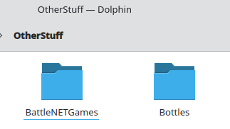
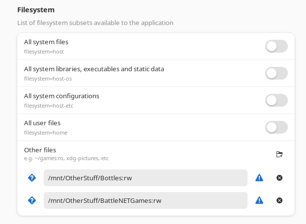
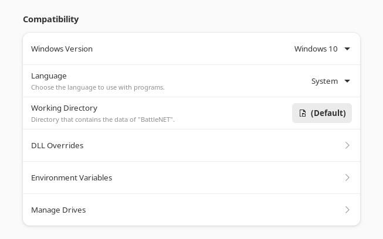
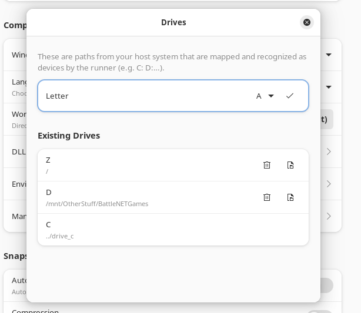
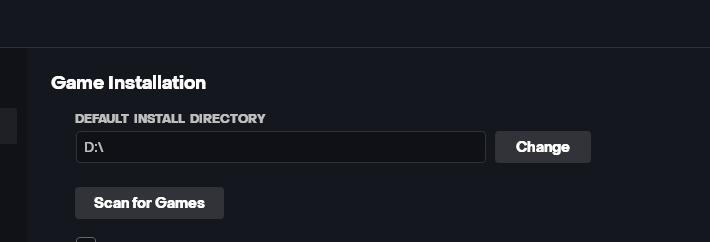

# How to install and configure Battle.NET on Linux
* Install `Bottles`
* Create a separate folder for games outside of BattleNET bottle

* Configure `Flatseal` to give permissions for both folders with read + write

* Attach a separate drive in `Bottles` for the game folder via `Manage Drives`

* Install `Battle.NET`

* Switch default directory and scan for games in the mounted drive

