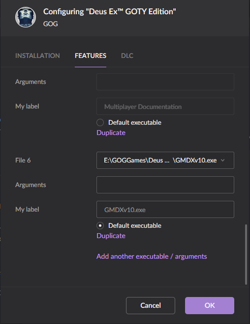

# Install `Deus Ex` from your GOG.com account
# Two options here:
* Install [GMDX Mod](https://www.moddb.com/mods/gmdx-v10-community-update) (or check in Google Drive for the setup file from 01.04.2022)
* Install [Kentie's Launcher](https://kentie.net/article/dxguide/) (or check in Google Drive) (* RECOMMENDED for vanilla experience)

# Set up GOG.com launcher (required only if you use GMDX mod)

# To show FPS press T and when the `> Say` input appears down - delete `Say` and type `Stat FPS` and press enter.

# If you have low FPS - use the `Direct3D 10 (DirectX 10) renderer` or `OpenGL renderer`

# To open additional settings for graphics type `preferences` in chat, should say `> preferences`, not `> Say preferences`

# Use `Borderless Fullscreen` mode to be able to minimize from the game without freezing

# If you experience stutters or freezes when opening menus use regular `Fullscreen`

# Have fun