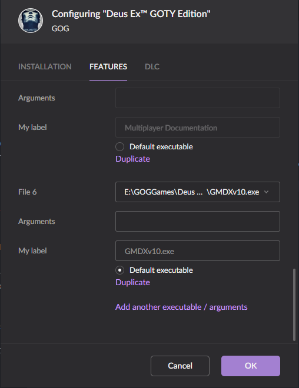

# Install `Deus Ex` from your GOG.com account
# Install [GMDX Mod](https://www.moddb.com/mods/gmdx-v10-community-update) (or check in Google Drive for the setup file from 01.04.2022)
# Set up GOG.com launcher

# To show FPS press T and when the `> Say` input appears down - delete `Say` and type `Stat FPS` and press enter.

# If you have low FPS - use the `Direct3D 10 (DirectX 10) renderer`

# Have fun