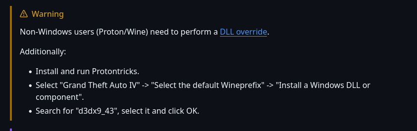

# Add launcher parameters in `Steam`:
* `-fullspecaudio -novblank -norestrictions -nomemrestrict -availablevidmem 4000 -reservedApp 0`
# Add `DXVK` to the game
# Use [https://github.com/ThirteenAG/GTAIV.EFLC.FusionFix/](https://github.com/ThirteenAG/GTAIV.EFLC.FusionFix/)
* For running the patch under Linux check this:
