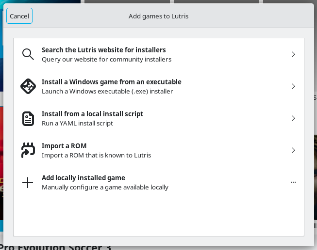
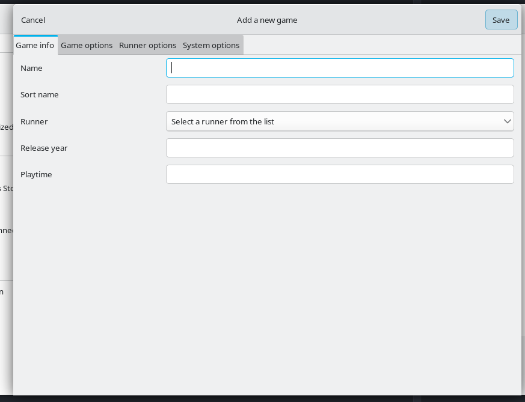
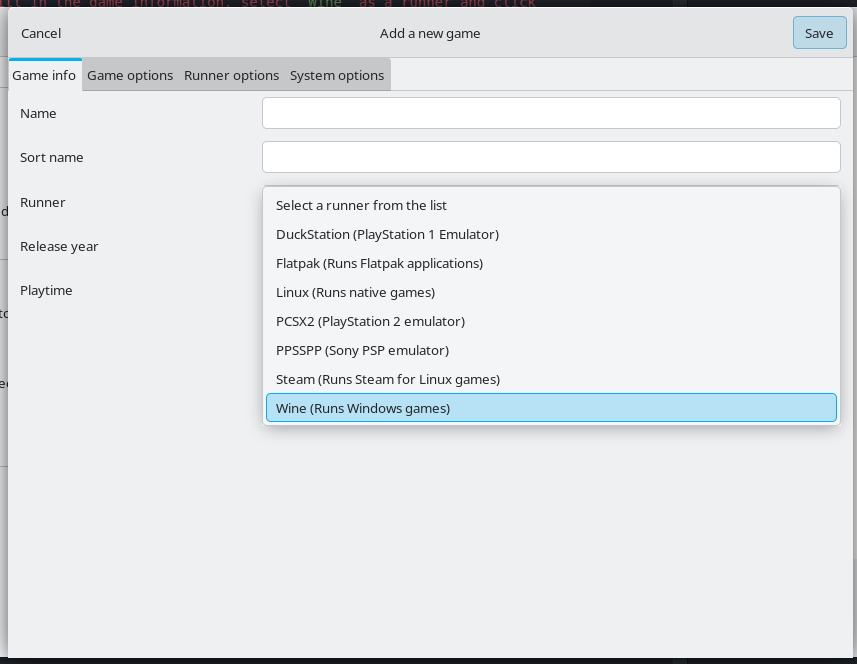
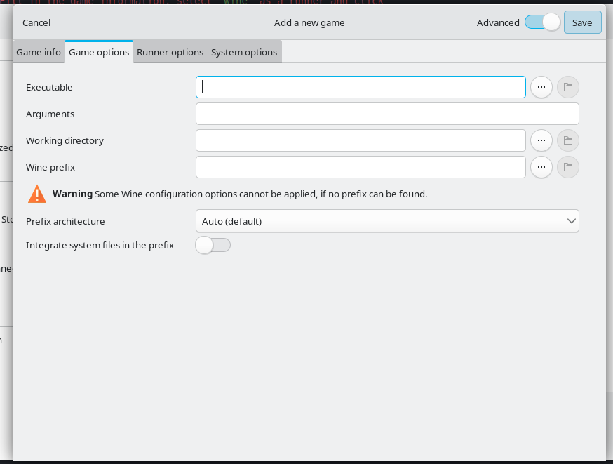
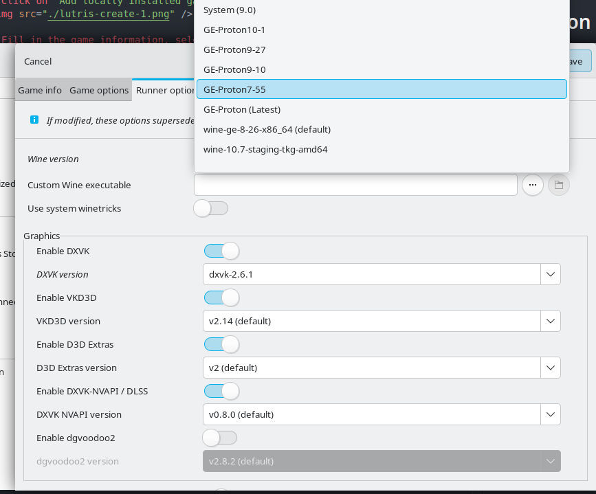

# Click on `Add locally installed game`

# Fill in the game information, select `Wine` as a runner and click `Game Options`

# Use the [https://github.com/AleksandarBayrev/empty-dotnet](https://github.com/AleksandarBayrev/empty-dotnet) repo to create a blank exe and select it as a game executable and select a directory for the `Wine prefix` (example: `/home/myuser/Games/gta-sa`)

# In `Runner options` select your `Wine version`

# Click save and run the newly created prefix to generate the required files