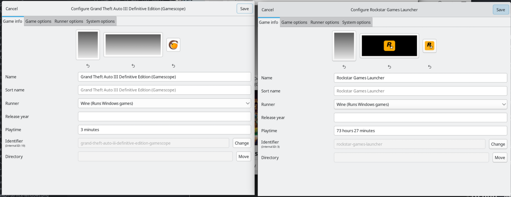
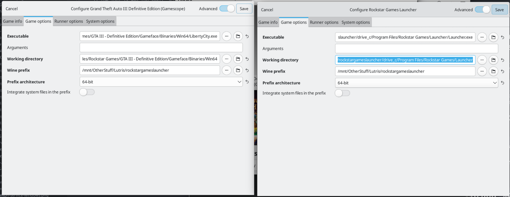
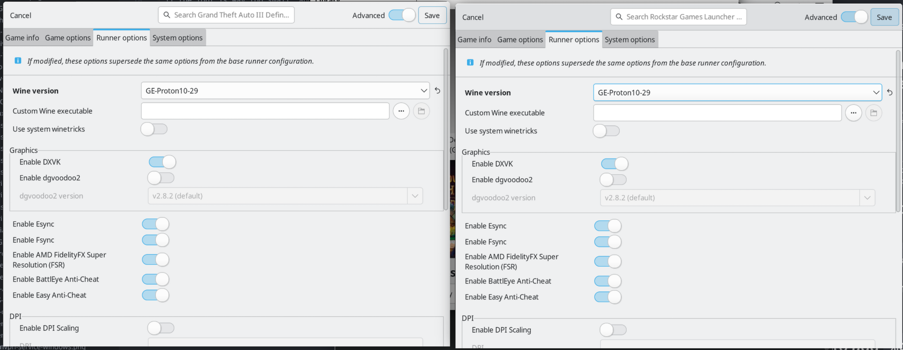
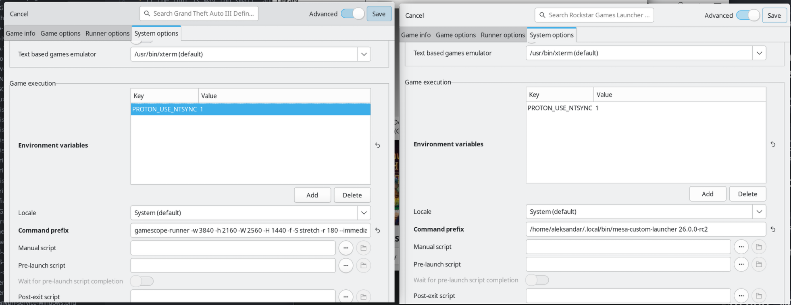

# If you want to run a specific game from a `Battle.NET`/`Rockstar Games Launcher`/etc. - add a new Lutris entry
* Make sure the Wine prefix points to `Battle.NET`/`Rockstar Games Launcher`/etc.
* Customize launch options whatever you like - advantage is that you can run a separate Mesa driver per game for example, or use gamescope (as this is the main reason the tutorial is made).

# IMPORTANT!!! - DO NOT FORGET TO CLOSE THE MAIN LAUNCHER BEFORE STARTING THE PER-GAME INSTANCE, OTHERWISE THE OVERRIDES WON'T WORK!!!