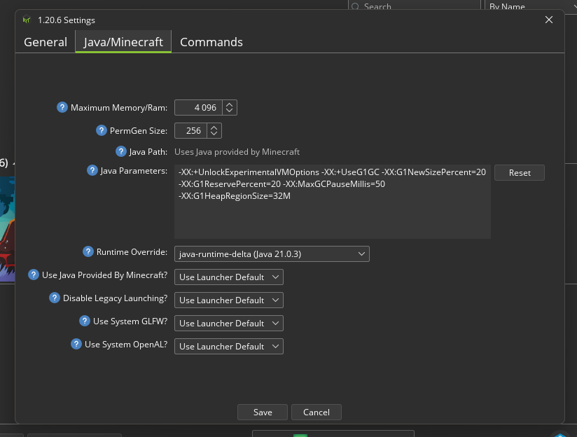

# How to set up Minecraft
* Install `ATLauncher` (Flatpak)
* Login with Microsoft account
* Install your version of choice
* Add Fabric to Minecraft
* Download `FabricAPI`, `Iris`, `Iris Shaders`, `Sodium`, `FPSDisplay`, `Xaero's Minimap`, `Xaero's World Map`, `Jade`, `Vulkan Mod` (if running on Windows), `Complementary Shaders - Unbound` (shaders) mods for your version (or check `minecraft-mods` folder and copy it to `mods`)
* Download `Default-Dark-Mode` (or check `minecraft-resourcepacks` and copy it to `resourcepacks`)
* Change Java version

* To restore backed up instances - unzip the zip for the version you like - currently 1.20.4 and 1.21 - and copy `mods` folder into the newly installed game
* Import `ComplementaryUnbound_r5.4.zip.txt` if you use the shader
* Play