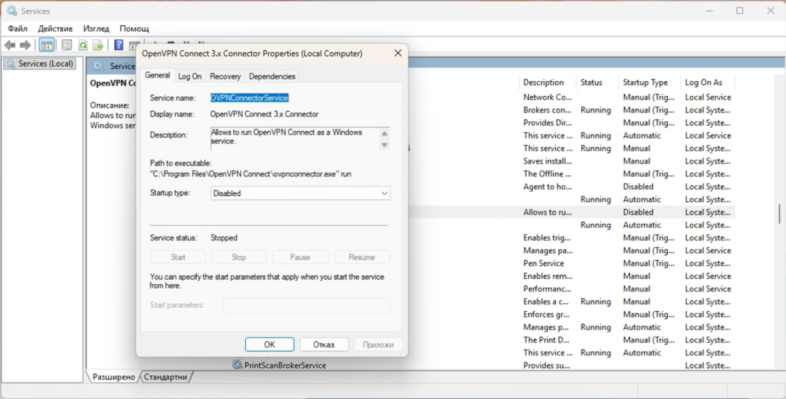

# Check Use OpenVPN Connect v3 on Windows in Service Daemon Mode.pdf
* Describes how to setup auto connect to VPN using OpenVPN (and how to stop it).
# If the service is already set up - manage it via Windows Services
