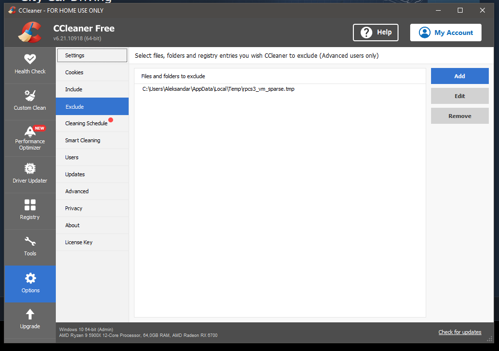

# Check `rpcs3-settings` folder to see how to setup RPCS3 (tested on Ryzen 9 7945HX with Debian 12 + Flatpak version of RPCS3)
## If you have black screen problems set Vulkan Scheduler to safe.
## If you run RPCS3 on Windows and use software such as CCleaner add rpcs3_vm_sparse.tmp file to exclusions
