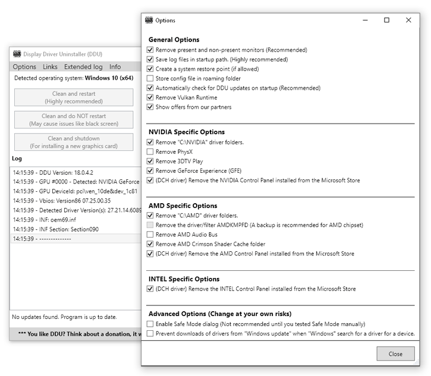
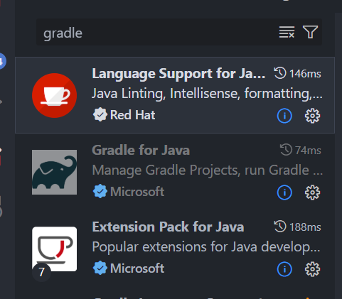
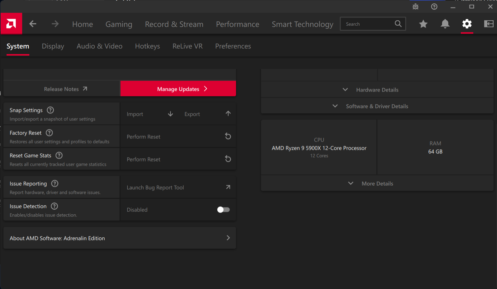
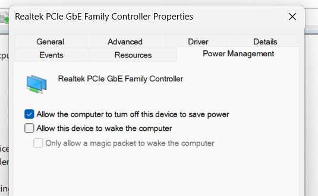

# Windows Setup
* Install `Enterprise LTSC`/`Enterprise IoT LTSC` version of whatever Windows you want.
* If using `Windows 11` install [Explorer Patcher](https://github.com/valinet/ExplorerPatcher) and import the settings from `explorer-patcher` folder
* Enable `File name extension` for all files
* Disable `Game Bar`
* Disable `Memory Integrity` from `Core Isolation`
* Disable all privacy related features, disable Feedback frequency
* Disable `USB Selective suspending`
* Let the system fully update, then run [Display Driver Uninstaller](https://www.guru3d.com/download/display-driver-uninstaller-download/) to remove the installed GPU drivers from Windows Update

Select the `Prevent downloads of drivers from "Windows update" when "Windows" searches for a driver`

* Disable `Fast Startup`
* Activate Windows (`KMS Tools`, [Massgravel MAS](https://github.com/massgravel/Microsoft-Activation-Scripts))
# For the apps check `apps-to-install.ubundle` file - open it with UniGetUI OR install the apps below manually.
* Install `btop4win`
* Install `Quick CPU` to disable core parking.
* Install `Chocolatey` and `Chocolatey GUI` (optional, if  you want to manage software updates manually per app)
* Install `Geek Uninstaller`
* Install `SSD Tools (ADATA/Samsung)`
* Install `MSI Afterburner` for fan control (if possible (eg. on laptops it won't be)) and `Riva Tuner` (should be bundled with MSI Afterburner) to limit FPS
* Install `Firefox` for browser.
* Install `.NET Framework 3.5`, `Legacy Components`, `Media Features`, `Virtual Machine Platform` (if not using `VMWare`), `Windows Hypervisor Platform` from `Turn Windows features on or off`
* Install `Hyper-V` (or `VMWare`) (if Virtual Machines are needed)
* Install `Microsoft PowerToys` to use FancyZones on Windows 10. Check `fancy-zones-setup.png` on how to set up it properly.
* Install `CCleaner`, `GIMP`, `Inkscape`, `Handbrake`, `Discord`, `Kdenlive`, `Avidemux`, `Crystal Disk Info`, `HWINFO`, `HWMonitor`, `OnlyOffice`, `OBS Studio`, `Postman`, `Visual Studio Code`, `qBittorrent`, `VLC`, `WinSCP`, `MediaInfo`, `Audacity`, `FFmpeg Full`, `Vencord`, `Ventoy`, `Image Glass`
* Install `Steam`, `GOG Galaxy`, `ATLauncher`, `Battle.NET`, `Epic Games Launcher`
* Install WSL, install latest LTS Ubuntu and install the SDKs (NVM, .NET, SDKMan [Java, Gradle]) there, then use VS Code on the main machine (use `Ctrl+Shift+P`, type `WSL` and select `Connect to WSL`).
* For WSL - run `sudo apt install x11-apps -y` on Ubuntu to be able to run GUI apps through it.
* Install the Java stuff on the WSL, not on the host machine.

* Install emulators - `Duckstation`, `PCSX2`, `PPSSPP`
* Check `windows-11-fix-for-amd-rv-intel-virt.pdf` to fix VMWare errors with VMs that have enabled virtualization. (Mainly `Disable Turn On Virtualization Based Security.` and `bcdedit /set hypervisorlaunchtype off` OR `Disable side channel mitigations for Hyper-V enabled hosts` per VM under `Virtual Machine Settings` -> `Options` -> `Advanced`)
* Use `wushowhide` to hide `KB5034441` if it fails (for Windows 10).
* Install audio drivers from laptop/motherboard manufacturer for built-in audio devices.
* Disable `Sticky Keys`, `Toggle Keys`, `Filter Keys`
* Disable `USB Selective Suspending` in `Power Plan options`
* Disable `Animation effects` and `Transparency effects`
* Disable `Game Overlay` in `Discord`
* Install `KDE Connect` to sync your phone with your PC
* Install `Viber`, `Telegram`
* Install `Virtual CloneDrive`
* Disable `Activity History`
* Disable `Shader Caching` for `Steam`
* Use `VKD3D Proton` and `DXVK`/`DXVK GPLAsync` for games that behave poorly under Windows (check if `DXVK` first and then use `DXVK GPLAsync` if the previous doesn't work better).
* For AMD GPU builds - disable `Issue detection` in AMD Software Adrenalin.

## If monitor sleep is not working - disalbe LAN power management from `Device Manager`

* and then 
* Go to this registry key: HKEY_LOCAL_MACHINE\SYSTEM\CurrentControlSet\Control\Power\PowerSettings\238C9FA8-0AAD-41ED-83F4-97BE242C8F20\7bc4a2f9-d8fc-4469-b07b-33eb785aaca0
* Double click Attributes
* Enter the value as 2

* For `QuickCPU`: import quick-cpu-ultimate-performance.pow profile (replace the built-in Windows one with it)

## To permanently disable `ms-gamingoverlay` popup in LTSC Windows 11:
### Find HKEY_CURRENT_USER\SOFTWARE\Microsoft\Windows\CurrentVersion\GameDVR and set the DWORD `AppCaptureEnabled` to `0`
### Find HKEY_CURRENT_USER\System\GameConfigStore and set the DWORD `GameDVR_Enabled` to `0`
## To add custom resolutions use your driver's control panel and add them.