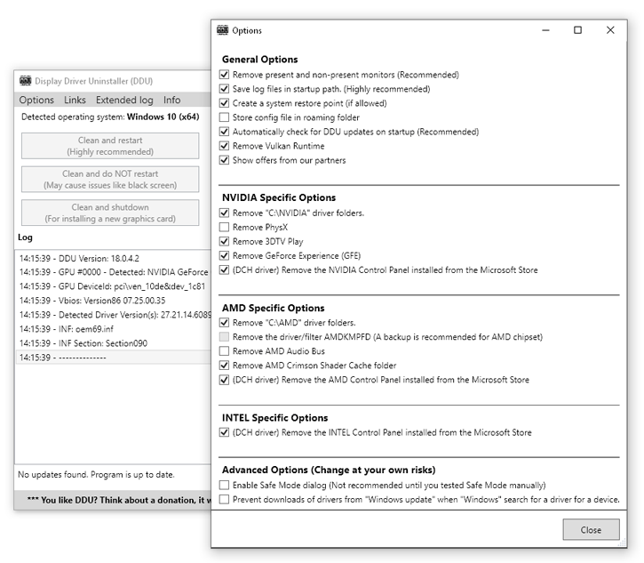

# Windows Setup
* Install `Enterprise LTSC`/`Enterprise IoT LTSC` version of whatever Windows you want.
* Disable `Game Bar`
* Let the system fully update, then run [Display Driver Uninstaller](https://www.guru3d.com/download/display-driver-uninstaller-download/) to remove the installed GPU drivers from Windows Update

Select the `Prevent downloads of drivers from "Windows update" when "Windows" searches for a driver`

* Activate Windows (`KMS Tools`, [Massgravel MAS](https://github.com/massgravel/Microsoft-Activation-Scripts))
* Install `Chocolatey` and `Chocolatey GUI`
* Install `Geek Uninstaller`
* Install `SSD Tools (ADATA/Samsung)`
* Install `MSI Afterburner` for fan control (if possible (eg. on laptops it won't be)) and `Riva Tuner` (should be bundled with MSI Afterburner) to limit FPS
* Install `Firefox` for browser and `Thunderbird` for e-mail client.
* Install `Hyper-V` (or `VMWare`)
* Install `Microsoft PowerToys` to use FancyZones on Windows 10. Check `fancy-zones-setup.png` on how to set up it properly.
* Install `CCleaner`, `GIMP`, `Inkscape`, `Handbrake`, `Discord`, `Kdenlive`, `Avidemux`, `Crystal Disk Info`, `HWINFO`, `HWMonitor`, `LibreOffice`, `OBS Studio`, `Postman`, `Visual Studio Code`, `qBittorrent`, `VLC`, `FileZilla`, `MediaInfo`, `Audacity`, `FFmpeg Full`, `Vencord`, `Ventoy`, `Caprine`
* Install `Steam`, `GOG Galaxy`, `ATLauncher`, `Battle.NET`
* Install `.NET SDKs` and `NVM for Windows`
* Install emulators - `Duckstation`, `PCSX2`, `PPSSPP`
* Check `windows-11-fix-for-amd-rv-intel-virt.pdf` to fix VMWare errors with VMs that have enabled virtualization. (Mainly `Disable Turn On Virtualization Based Security.` and `bcdedit /set hypervisorlaunchtype off` OR `Disable side channel mitigations for Hyper-V enabled hosts` per VM under `Virtual Machine Settings` -> `Options` -> `Advanced`)
* Use `wushowhide` to hide `KB5034441` if it fails (for Windows 10).
* Install audio drivers from laptop/motherboard manufacturer for built-in audio devices.
* Disable `Sticky Keys`, `Toggle Keys`, `Filter Keys`
* Disable `Animation effects` and `Transparency effects`
* Disable `Game Overlay` in `Discord`
* Install `KDE Connect` to sync your phone with your PC